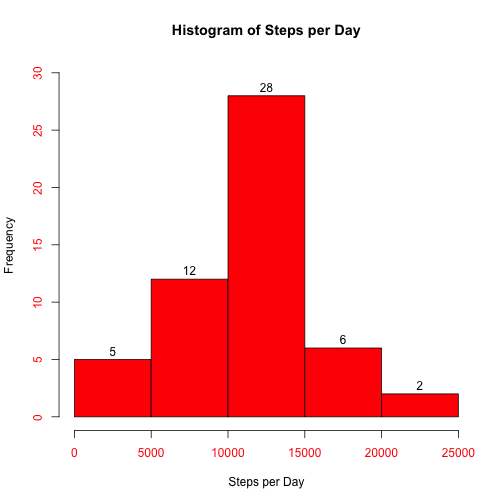
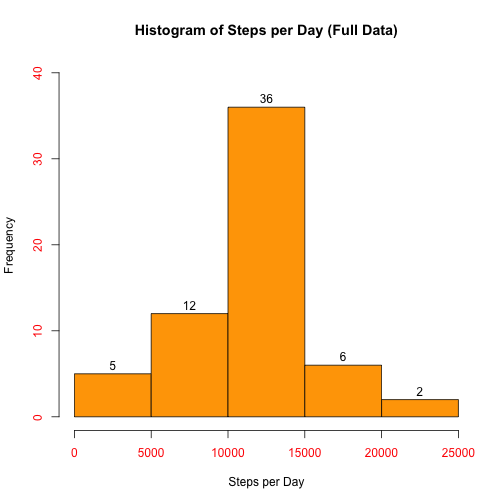

---
title: "Reproducible Research: Peer Assessment 1"
author: "Patrick Bolger"
date: 2015-09-18
output: 
  html_document:
    keep_md: true
---
**Please note the following:**

1. This document should be processed in the same directory that contains the "raw" data file, _activity.csv_.

2. Text in bold below reflects specific directions given in the assignment.  Some of those directions are included here (and possibly re-worded) in order to make the narrative clearer.

## Loading and preprocessing the data

This code chunk loads and processes the data for analysis:


```r
process_input_data <- function(df) {
    daytype_vector <- vector(mode='character', length=0)
    for(day in df$date) {
        day_of_week <- weekdays(as.Date(day))
        if(day_of_week=='Saturday' | day_of_week=='Sunday') {
            daytype_vector <- c(daytype_vector, 'Weekend')
        } else {
            daytype_vector <- c(daytype_vector, 'Weekday')
        }
    }
    ## add vector to original dataframe
    df$daytype <- factor(daytype_vector)
    df
}

data <- read.csv('activity.csv', stringsAsFactors=FALSE)
data <- process_input_data(data)
```

We can examine the structure of the processed data frame:


```r
str(data)
```

```
## 'data.frame':	17568 obs. of  4 variables:
##  $ steps   : int  NA NA NA NA NA NA NA NA NA NA ...
##  $ date    : chr  "2012-10-01" "2012-10-01" "2012-10-01" "2012-10-01" ...
##  $ interval: int  0 5 10 15 20 25 30 35 40 45 ...
##  $ daytype : Factor w/ 2 levels "Weekday","Weekend": 1 1 1 1 1 1 1 1 1 1 ...
```

## What is mean total number of steps taken per day?

**Make a histogram of the total number of steps taken each day:**


```r
steps_per_day <- tapply(data$steps, data$date, sum)
hist(steps_per_day, main='Histogram of Steps per Day', ylab='Frequency', xlab='Steps per Day', labels=T, col.axis='red', col='red', ylim=range(0,30))
```

 

From the histogram we can see that the number of steps per day somewhat reflects a normal distribution.

**Calculate and report the mean and median of the total number of steps taken per day:**


```r
mean(steps_per_day, na.rm=T)
```

```
## [1] 10766.19
```

```r
median(steps_per_day, na.rm=T)
```

```
## [1] 10765
```

## What is the average daily activity pattern?

**Make a time series plot (i.e. type = "l") of the 5-minute interval (x-axis) and the average number of steps taken, averaged across all days (y-axis):**


```r
# subset data to remove NA values in 'steps' variable
pd <- data[!is.na(data$steps), ]
# Create data frame for plotting
pd <- select(pd, steps, interval) %>% group_by(interval) %>% summarize(interval_steps = mean(steps))
par('pch'=1, col='red', cex=1, 'mar'=c(6.5, 4,4,2), 'mgp'=c(3,1.5,0), 'font.sub'=3)
with(pd, plot(interval, interval_steps, type='l', ylab='Avg steps during interval', xlab='5-minute intervals (aggregated across all days)'))
title(main='Average number of steps for each 5-minute interval')
```

 

**Which 5-minute interval, on average across all the days in the dataset, contains the maximum number of steps?**


```r
# Find 5-minute interval with maximum average steps
pd[which.max(pd$interval_steps), ]
```

```
## Source: local data frame [1 x 2]
## 
##   interval interval_steps
## 1      835       206.1698
```

We can see that the maximum average number of steps occurs at time interval ending at **08:35 a.m.**, with an average of **206** steps being taken between minutes 30 and 35 of that hour.

## Imputing missing values

**Calculate and report the total number of missing values in the dataset (i.e. the total number of rows with NAs).**


```r
sum(is.na(data$steps))
```

```
## [1] 2304
```
The code above shows us that there are 2,304 rows with missing ('NA') values.  

We also confirm that only rows with missing 'steps' variable are included in that number.  


```r
sum(is.na(data$steps)) == sum(is.na(data[,]))
```

```
## [1] TRUE
```

A visual inspection of the data confirms that the 'steps' variable is the only variable with missing values.

**Devise a strategy for filling in all of the missing values in the dataset.**

The strategy used here will be to convert all missing 'steps' values to the average value, across all days, for the specific 5-minute interval.

**Create a new dataset that is equal to the original dataset but with the missing data filled in.**

Convert NA values for 'steps' to the mean across all days for that time interval (use previous data frame created for plotting that contains mean values for each time interval):

```r
# Create a character vector containing the dates with missing values
days_with_NA <- unique(data[is.na(data$steps), 'date'])
# Create a new data set to contain all the data (including imputed missing values)
data_full <- data
# Change all missing 'steps' values, for each day with missing values, to equal the 
# average number of steps for the 5-minute interval (round the interval_steps to the 
# nearest integer for this operation)
data_full[data_full$date %in% days_with_NA, 'steps'] <- round(pd$interval_steps)
```

Confirm that all missing values are now gone:


```r
sum(is.na(data_full$steps)) == 0
```

```
## [1] TRUE
```

**Make a histogram of the total number of steps taken each day:**


```r
steps_per_day <- tapply(data_full$steps, data_full$date, sum)
hist(steps_per_day, main='Histogram of Steps per Day (Full Data)', ylab='Frequency', xlab='Steps per Day', labels=T, col.axis='red', col='orange', ylim=range(0,40))
```

 

**Calculate and report the mean and median total number of steps taken per day:**


```r
mean(steps_per_day, na.rm=T)
```

```
## [1] 10765.64
```

```r
median(steps_per_day, na.rm=T)
```

```
## [1] 10762
```

**Do these values differ from the estimates from the first part of the assignment?**

The differences are very small due to the fact that I chose to convert all missing values to the corresponding mean value, across all days, for each specific time interval.  Hence, the mean values between the original and 'full' data sets are not significant.  The median value, for the original data, was essentially the same as the mean value.  Hence, for the 'full' data, adding more observations with mean values would thus be expected to cause the median to be lower than original data by about one half of days added to the full data.  This number was eight, and the shift in median between the original and full data is three (close to the estimated number of four)).

**What is the impact of imputing missing data on the estimates of the total daily number of steps?**

The impact is negligible since the imputing strategy was to define the missing steps values as equal to the average steps for each 5-minute interval.


## Are there differences in activity patterns between weekdays and weekends?

**Make a panel plot containing a time series plot (i.e. type = "l") of the 5-minute interval (x-axis) and the average number of steps taken, averaged across all weekday days or weekend days (y-axis):**


```r
panel_data <- select(data_full, steps, interval, daytype) %>% group_by(daytype) %>% group_by(interval, add=TRUE) %>% summarize(interval_steps = mean(steps))
xyplot(panel_data$interval_steps ~ panel_data$interval | panel_data$daytype, layout=c(1,2),type='l', xlab='Interval', ylab='Number of steps')
```

 

For the plots, we can see some differences in activity patterns:

1. On weekdays, there is a sharp jump in activity, corresponding (presumably) to people getting up and hurrying to get ready for work.  The rise in activity, in the morning, is much more gradual on weekends.
2. On weekdays, there is a peak of activity in the morning, reflecting the process of getting to the workplace.  After the peak, the activity drops down considerably.  There is a brief, and much smaller, peak of activity at the end of the working data (people heading back home, one assumes).
3. Weekend days show a more sustained, higher level of activity throughout the daylight hours, compared to weekend days.
